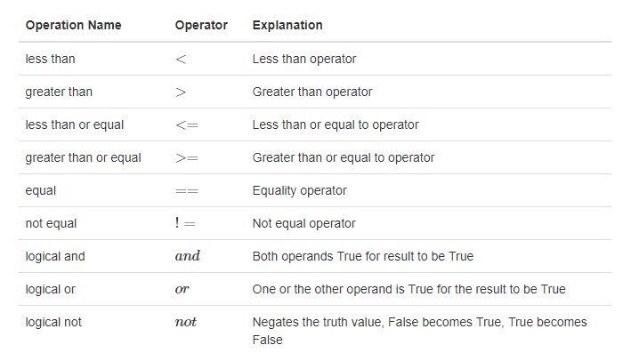
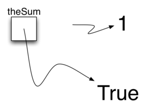
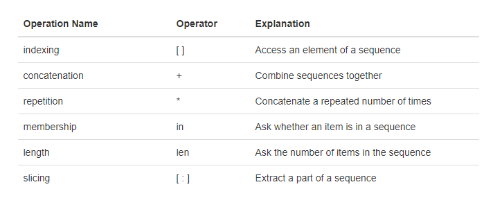
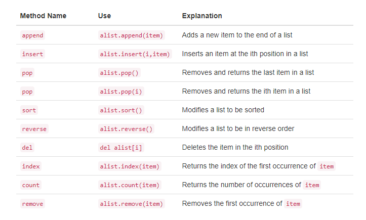
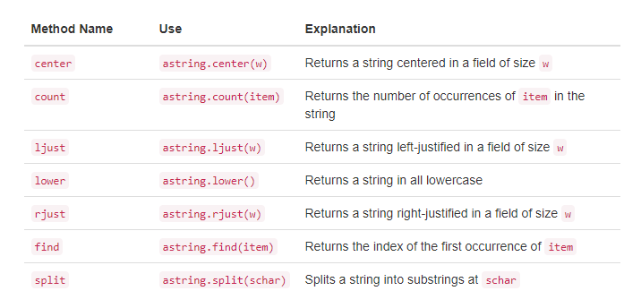
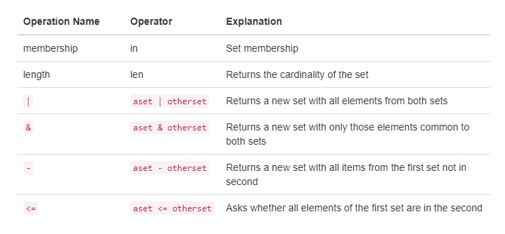
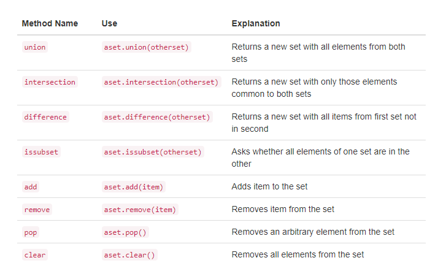
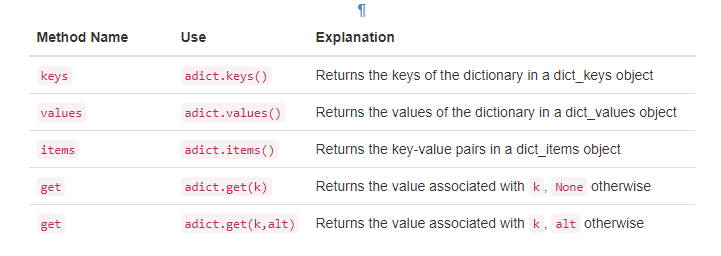

## 1.8.数据入门

我们在上面说过，Python支持面向对象的编程范式。这意味着Python认为在解决问题的过程中的重点是数据。在Python中，以及在任何其他面向对象的编程语言中，我们定义一个类来描述数据的外观（状态）和数据能做什么（行为）。因为类的用户只看数据项的状态和行为，所以类类似于抽象的数据类型。数据项在面向对象的范式中称为对象。 对象是类的实例。


### 1.8.1.内置的原子数据类型

通过思考原子数据类型来开始我们的回顾。Python有两个主要的内置数字类，它们实现了整型和浮点数据类型。这些Python类称为int和float。标准的算术运算，+，-，*，/，和**（取幂），可以用括号强制操作的顺序来规避正常的操作符优先级。其他很有用的操作是余数（模组）操作符%、和整数除法//。注意，当两个整数相除，结果是一个浮点数。整数除法运算符通过截断所有小数部分来返回商的整数部分。

布尔数据类型，作为Python bool类的实现，在表示真值时非常有用。在标准的布尔操作中，and、or、not，布尔类型的状态值可能是True和False。

````
>>> True
True
>>> False
False
>>> False or True
True
>>> not (False or True)
False
>>> True and True
True
````

布尔数据对象也被用作比较运算符的结果，例如相等（==）和大于（>）。此外，关系运算符和逻辑运算符可以组合在一起形成复杂的逻辑问题。表1展示了关系和逻辑运算符，例子如下所示。



标识符在编程语言中作为名称使用。在Python中，标识符以字母或下划线（_）开头，大小写敏感，并且可以是任意长度的。请记住，使用表示含义的名称总是一个好主意，这样您的程序代码就更容易阅读和理解。

在赋值语句的左边第一次使用一个名称时，就会产生一个Python变量。赋值语句提供了一种将名称与值关联起来的方法。该变量将持有对一块数据的引用而不是数据本身。思考以下会话:

````
>>> theSum = 0
>>> theSum
0
>>> theSum = theSum + 1
>>> theSum
1
>>> theSum = True
>>> theSum
True
````

赋值语句theSum = 0创建一个变量称为theSum并让它持有对数据对象0的引用(参见Figure 3)。通常，会对赋值语句的右侧进行求值，并将对结果数据对象的引用“赋值”给左侧的名称。如上所示，如果数据的类型发生变化（参见Figure 3），布尔值为True，那么变量的类型也如此（theSum现在是布尔型）。赋值语句改变了变量所持有的引用。相同的变量可以引用许多不同类型的数据。


*Figure 3*



*Figure 4*


### 1.8.2.内置的集合数据类型

除了数字和布尔类之外，Python还有许多非常强大的内置集合类。列表、字符串和元组是有序集合，它们在常用的结构中非常相似，但是有特定的差异，必须理解它们才能正确使用。集合和字典是无序的集合。

列表是对Python数据对象的零个或多个引用的有序集合。列表的写法是用方括号括起来、以逗号分隔。空列表简单的用[]表示。列表是异构的，这意味着数据对象不需要全部是同一类型，并且集合可以赋值给一个变量，如下所示。下面的代码展示了列表中的各种Python数据对象。

````
>>> [1,3,True,6.5]
[1, 3, True, 6.5]
>>> myList = [1,3,True,6.5]
>>> myList
[1, 3, True, 6.5]
````

请注意，当Python对列表求值时，会返回列表本身。然而，为了记住后面的列表操作，它的引用需要赋值给一个变量。

由于列表被认为是按顺序排列，所以它们支持许多可以应用于任何Python序列的操作。Table 2回顾了这些操作，以下给出了它们的使用示例。



*Table 2*

注意，列表（序列）的索引从0开始计数。切片操作，myList[1:3]，返回一个包含索引从1到3的项的列表、但不包含索引为3的项。

有时，您需要初始化一个列表。这可以通过使用重复操作快速完成。例如，

````
>>> myList = [0] * 6
>>> myList
[0, 0, 0, 0, 0, 0]
````

除了重复操作符之外，还有一个非常重要的问题是其结果是对序列中的数据对象的引用的重复。通过思考以下代码得到最好的印证：

````
myList = [1,2,3,4]
A = [myList]*3
print(A)
myList[2]=45
print(A)
````

变量A持有三个名为myList的原始列表的引用。注意，对myList的一个元素的更改，在A的所有三种情况中都体现了出来

列表支持许多用于构建数据结构的方法。Table 3提供了总结。下面是使用他们的例子。



*Table 3*

````
myList = [1024, 3, True, 6.5]
myList.append(False)
print(myList)
myList.insert(2,4.5)
print(myList)
print(myList.pop())
print(myList)
print(myList.pop(1))
print(myList)
myList.pop(2)
print(myList)
myList.sort()
print(myList)
myList.reverse()
print(myList)
print(myList.count(6.5))
print(myList.index(4.5))
myList.remove(6.5)
print(myList)
del myList[0]
print(myList)
````

你可以看到一些方法，比如pop，返回一个值，并修改列表。其他的，比如反向，只是简单地修改列表，没有返回值。pop会默返回列表的末尾项，也能删除并返回一个特定项。这些方法再次使用从0开始的索引范围。您还应该注意到熟悉的“dot”符号，使对象调用方法。myList.append（False）可以被认为是“请求对象myList执行它的append方法，并将其发送给False”。即使是像整数这样的简单数据对象也可以以这种方式调用方法。

````
>>> (54).__add__(21)
75
>>>
````

在此段中，我们让整型对象54来执行它的add方法（在Python中称为__add__），并将它与传过去的21相加，结果是75。当然，我们通常把它写成54+21。稍后我们将在本节中详细介绍这些方法。

通常与列表一起讨论的一个常见的Python函数是range函数。range产生一个范围对象，表示一系列的值。通过使用list函数，我们可以将range对象的值看作一个列表。如下所示：

````
>>> range(10)
range(0, 10)
>>> list(range(10))
[0, 1, 2, 3, 4, 5, 6, 7, 8, 9]
>>> range(5,10)
range(5, 10)
>>> list(range(5,10))
[5, 6, 7, 8, 9]
>>> list(range(5,10,2))
[5, 7, 9]
>>> list(range(10,1,-1))
[10, 9, 8, 7, 6, 5, 4, 3, 2]
>>>
````

range对象代表一个整数序列。默认情况下，它将从0开始。如果您提供了更多的参数，它将在特定的点开始和结束，甚至可以跳过某项。在我们的第一个例子中，range（10），序列从0开始，递增到10但不包括10。在第二个例子中，范围（5,10）从5开始，递增到10但不包括10。范围（5,10,2）类似的执行，但是跳过2（同样，10不包括在内）。

字符串是由零个或多个字母、数字和其他符号组成的序列集合。我们称之为字母，数字和其他符号字符。通过使用引号（单引号或双引号）将文字字符串值与标识符区分开来。

````
>>> "David"
'David'
>>> myName = "David"
>>> myName[3]
'i'
>>> myName*2
'DavidDavid'
>>> len(myName)
5
>>>
````

由于字符串是序列，所以上面描述的所有序列操作都按照您的预期工作。另外，字符串有许多方法，其中一些方法如Table 4所示。例如,

````
>>> myName
'David'
>>> myName.upper()
'DAVID'
>>> myName.center(10)
'  David   '
>>> myName.find('v')
2
>>> myName.split('v')
['Da', 'id']
````

其中，split对于处理数据非常有用。split将使用一个字符串，并使用分割字符作为分隔点返回字符串列表。在这个例子中，v是分隔点。如果没有指定分隔点，split方法会寻找空格字符，如制表符、换行符和空格。



*Table 4*

列表和字符串之间的主要区别是，列表可以被修改，而字符串不能。这被称为可变性。列表是可变的;字符串是不可变的。例如，您可以通过使用索引和赋值来更改列表中的项。任何一个改变是不允许的。

````
>>> myList
[1, 3, True, 6.5]
>>> myList[0]=2**10
>>> myList
[1024, 3, True, 6.5]
>>>
>>> myName
'David'
>>> myName[0]='X'

Traceback (most recent call last):
  File "<pyshell#84>", line 1, in -toplevel-
    myName[0]='X'
TypeError: object doesn't support item assignment
>>>
````

元组与列表非常相似，因为它们是异构的数据序列。不同之处在于，元组是不可变的，就像字符串一样。任何元组都不能被改变。元组的写法是用括号括起来并以逗号来分隔值。作为序列，它们可以使用上面描述的任何操作。例如,

````
>>> myTuple = (2,True,4.96)
>>> myTuple
(2, True, 4.96)
>>> len(myTuple)
3
>>> myTuple[0]
2
>>> myTuple * 3
(2, True, 4.96, 2, True, 4.96, 2, True, 4.96)
>>> myTuple[0:2]
(2, True)
>>>
````

但是，如果您试图改变元组中的一个项，您将会得到一个错误。注意，错误消息提供了问题的位置和原因。

````
>>> myTuple[1]=False

Traceback (most recent call last):
  File "<pyshell#137>", line 1, in -toplevel-
    myTuple[1]=False
TypeError: object doesn't support item assignment
>>>
````

set是一个无序的， 为空或是更多不可变Python数据对象集合。集合中的值不允许重复，以逗号分隔，写在大括号中。空集合由set()表示。集合是异构的并且可以被分配给一个变量，如下所示。

````
>>> {3,6,"cat",4.5,False}
{False, 4.5, 3, 6, 'cat'}
>>> mySet = {3,6,"cat",4.5,False}
>>> mySet
{False, 4.5, 3, 6, 'cat'}
>>>
````

尽管集合不被认为是连续的，但是它们确实支持前面提到的一些熟悉的操作。Table 5回顾了这些操作，以下给出了它们的使用示例。



*Table 5*

````
>>> mySet
{False, 4.5, 3, 6, 'cat'}
>>> len(mySet)
5
>>> False in mySet
True
>>> "dog" in mySet
False
>>>
````

集合支持许多方法，这些方法对于在数学集合中使用它们的人来说应该是熟悉的。 Table 6提供了总结。 它们的使用示例如下。 请注意，联合，交集，子集和差分都有可以使用的运算符。



*Table 6*

````
>>> mySet
{False, 4.5, 3, 6, 'cat'}
>>> yourSet = {99,3,100}
>>> mySet.union(yourSet)
{False, 4.5, 3, 100, 6, 'cat', 99}
>>> mySet | yourSet
{False, 4.5, 3, 100, 6, 'cat', 99}
>>> mySet.intersection(yourSet)
{3}
>>> mySet & yourSet
{3}
>>> mySet.difference(yourSet)
{False, 4.5, 6, 'cat'}
>>> mySet - yourSet
{False, 4.5, 6, 'cat'}
>>> {3,100}.issubset(yourSet)
True
>>> {3,100}<=yourSet
True
>>> mySet.add("house")
>>> mySet
{False, 4.5, 3, 6, 'house', 'cat'}
>>> mySet.remove(4.5)
>>> mySet
{False, 3, 6, 'house', 'cat'}
>>> mySet.pop()
False
>>> mySet
{3, 6, 'house', 'cat'}
>>> mySet.clear()
>>> mySet
set()
>>>
````

我们最后的Python集合是一个无序的结构，称为字典。字典是一组关联项，其中每一项由一个键和一个值组成。这个键-值对通常被写成key：value。字典的键值对以逗号分隔并用花括号括起来。例如,

````
>>> capitals = {'Iowa':'DesMoines','Wisconsin':'Madison'}
>>> capitals
{'Wisconsin': 'Madison', 'Iowa': 'DesMoines'}
>>>
````

我们可以通过它的键来访问一个值，或者通过添加另一个键-值对来操作字典。取值语法除了使用键值而不是使用项目的索引，看起来很像序列取值，添加新值类似。

````
capitals = {'Iowa':'DesMoines','Wisconsin':'Madison'}
print(capitals['Iowa'])
capitals['Utah']='SaltLakeCity'
print(capitals)
capitals['California']='Sacramento'
print(len(capitals))
for k in capitals:
   print(capitals[k]," is the capital of ", k)
````

需要注意的是，字典在键上没有特定的顺序。第一组加入('Utah': 'SaltLakeCity')首先被放在字典里，第二组加了('California': 'Sacramento')。键的位置取决于“哈希”的概念，这将在第4章中更详细地解释。我们还显示了与以前的集合执行相同角色的长度函数。

字典既有方法又有操作符。Table 7和Table 8描述了它们，会话显示了它们的作用。keys、values和items方法都返回包含感兴趣的值的对象。你可以使用list函数把它们转换成列表，还将看到get方法有两种变体。如果字典里没有对应键，get将返回空。然而，第二个可选参数可以指定一个返回值。


*Table 7*

````
>>> phoneext={'david':1410,'brad':1137}
>>> phoneext
{'brad': 1137, 'david': 1410}
>>> phoneext.keys()
dict_keys(['brad', 'david'])
>>> list(phoneext.keys())
['brad', 'david']
>>> phoneext.values()
dict_values([1137, 1410])
>>> list(phoneext.values())
[1137, 1410]
>>> phoneext.items()
dict_items([('brad', 1137), ('david', 1410)])
>>> list(phoneext.items())
[('brad', 1137), ('david', 1410)]
>>> phoneext.get("kent")
>>> phoneext.get("kent","NO ENTRY")
'NO ENTRY'
>>>
````



*Table 8*

